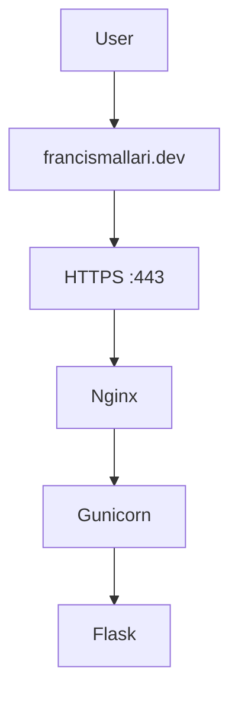

# 🚀 Project Atlas

Project Atlas is a hands-on Cloud Engineering and Site Reliability Engineering (SRE) portfolio project documenting the design, deployment, security, and operation of production-style infrastructure on AWS.

Each ticket represents a real engineering task with implementation steps, troubleshooting notes, verification commands, and evidence screenshots.

## Live Application

🌐 https://francismallari.dev

Repository: https://github.com/fmallari/project-atlas

Project Atlas is a hands-on engineering project where every milestone is treated as a production engineering ticket. Rather than following isolated tutorials, I document the complete engineering lifecycle—from infrastructure provisioning and deployment to validation, troubleshooting, observability, and operational documentation.


---

# Overview

Instead of simply deploying applications, this repository demonstrates how cloud infrastructure is provisioned, validated, monitored, documented, and improved using real engineering workflows.

Every completed ticket includes:

- Business objective
- Architecture
- Implementation
- Validation
- Incident investigation
- Operational lessons
- Runbook updates
- Resume-ready accomplishments

---
## 🌟 Portfolio Highlights

- Provisioned cloud infrastructure on AWS EC2
- Deployed a production-style Flask application
- Configured Gunicorn with systemd
- Implemented Nginx as a reverse proxy
- Performed structured incident investigations using Linux logs
- Built and validated application health checks
- Documented engineering tickets, runbooks, and operational lessons

# Current Architecture



---

# Technology Stack

## Cloud

- AWS EC2

## Operating System

- Ubuntu Linux

## Backend

- Python
- Flask
- Gunicorn

## Web Server

- Nginx

## DevOps

- systemd
- SSH
- Git
- GitHub

## Monitoring & Troubleshooting

- curl
- journalctl
- systemctl
- Nginx Access Logs
- Nginx Error Logs

---

# Completed Engineering Tickets

| Ticket | Description | Status |
|---------|-------------|--------|
| ✅ 001 | Provision AWS EC2 Development Server | Complete |
| ✅ 002 | Deploy Flask Application | Complete |
| ✅ 003 | Configure Gunicorn Application Server | Complete |
| ✅ 004 | Configure Nginx Reverse Proxy | Complete |
| ✅ 005 | Investigate Production Incident | Complete |
| ✅ 006 | Implement Application Health Checks | Complete |
| ✅ 007 | HTTPS with Let's Encrypt | Complete |
| 🚧 008 | Monitoring & Operations | In progress |
---

# Engineering Principles

Project Atlas follows a simple engineering philosophy:

> Gather evidence before making changes.

Every operational decision is supported by logs, validation, testing, or system observations.

---

# Repository Structure

```text
project-atlas/
│
├── docs/
│   ├── playbook/
│   ├── incidents/
│   └── runbooks/
│
├── architecture/
│
├── screenshots/
│
├── app/
│
└── README.md
```
---

# Skills Demonstrated

- Linux Administration
- Cloud Infrastructure
- Python Development
- Flask Deployment
- Gunicorn Configuration
- Nginx Administration
- Reverse Proxy Configuration
- Linux Service Management
- HTTP Troubleshooting
- Application Monitoring
- Incident Investigation
- Git Version Control
- Technical Documentation

---

# Roadmap

## Sprint 1 – Infrastructure

- ✅ EC2
- ✅ SSH
- ✅ Flask
- ✅ Gunicorn
- ✅ Nginx

## Sprint 2 – Observability

- ✅ Incident Investigation
- ✅ Health Checks

## Sprint 3 – Logging

- ⏳ Structured Logging
- ⏳ Application Metrics

## Sprint 4 – Containerization

- ⏳ Docker
- ⏳ Docker Compose

## Sprint 5 – Cloud Automation

- ⏳ Terraform
- ⏳ Infrastructure as Code

## Sprint 6 – CI/CD

- ⏳ GitHub Actions

---

## Featured Lessons

- How Nginx and Gunicorn work together
- Why `/health` endpoints matter
- Using `journalctl` for incident response
- Validating infrastructure with `curl`
- Reading Nginx access and error logs

# Why This Repository Exists

This repository documents my journey from software development into Cloud Engineering.

My goal isn't simply to build applications.

My goal is to build, operate, troubleshoot, document, and continuously improve reliable cloud infrastructure using industry-standard engineering practices.

---

# Connect

GitHub: https://github.com/fmallari

LinkedIn: https://www.linkedin.com/in/fmallari/
