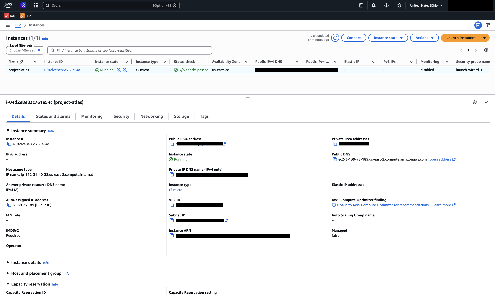

# Ticket #001 - Provision AWS EC2 Development Server

## Objective

Provision a Linux virtual machine in AWS that will serve as the foundation for deploying and operating a production-style Flask application.

---

## Business Requirement

The engineering team requires a cloud-hosted Linux server capable of hosting a Python web application. The server must support remote administration, application deployment, and future monitoring.

---

## Environment

Cloud Provider: AWS

Service: EC2

Operating System: Ubuntu Server LTS

Instance Type: t2.micro

Region: <your region>

SSH Access: Enabled

---

## Architecture

Developer Laptop
        │
        │ SSH
        ▼
AWS EC2 (Ubuntu)
        │
        ▼
Linux Shell

---

## Tasks Completed

- Created AWS EC2 instance
- Configured security group
- Allowed SSH access (Port 22)
- Connected using SSH
- Updated operating system packages
- Verified Internet connectivity

---
## Evidence

### AWS EC2 Instance

Successfully provisioned an Ubuntu EC2 instance for Project Atlas. The instance is running and passed all AWS status checks before application deployment.



## Commands Used

```bash
ssh -i <key>.pem ubuntu@<public-ip>

sudo apt update

sudo apt upgrade -y

hostname

pwd

ls
```

