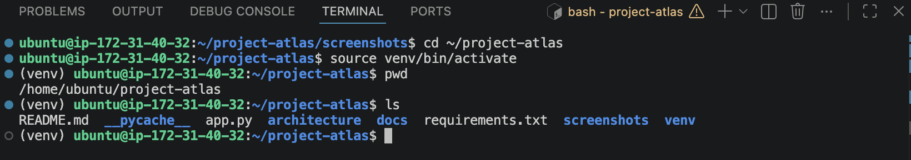
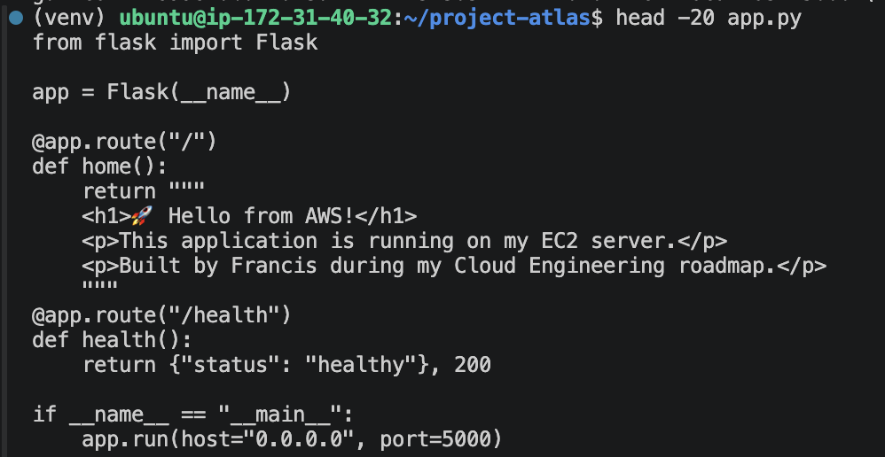

# Ticket #002 – Deploy Flask Application

## Overview

Deployed the initial Flask application to the EC2 instance and verified that the application was accessible locally.

## Objectives

- Configure Python environment
- Install Flask
- Launch application
- Verify local HTTP responses

## Technologies

- Python
- Flask
- Virtual Environment

## Evidence

### Python Virtual Environment

A dedicated Python virtual environment was created for Project Atlas to isolate the Flask application's dependencies from the Ubuntu system environment.

### Flask Application Validation

The Flask application was started successfully on the EC2 instance and returned a valid HTTP response. This confirmed that the application code, Python environment, and required dependencies were functioning correctly.

### Validation Result

The application responded successfully on port `5000`, confirming that the Flask development deployment was operational before introducing Gunicorn and Nginx.

## Outcome

Successfully deployed the first version of the Flask application.

