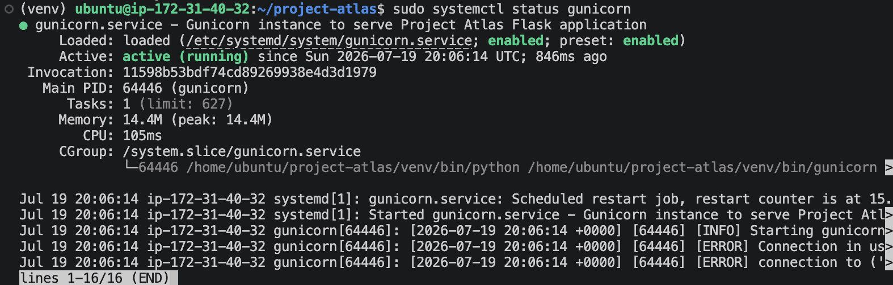
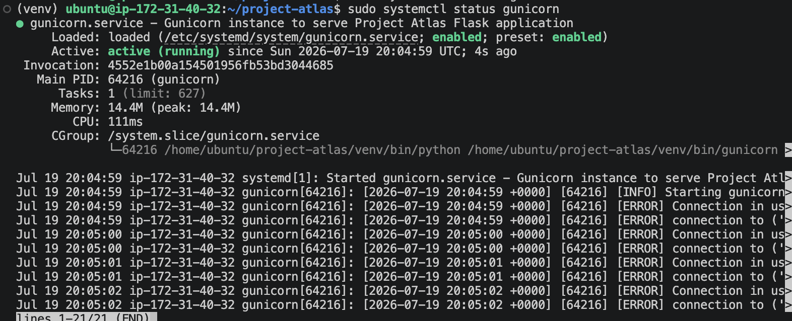
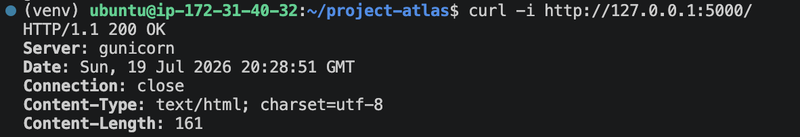

# Ticket #003 – Configure Gunicorn Application Server

## Overview

Configured Gunicorn as the production WSGI server responsible for serving the Flask application. Created a systemd service to automatically manage the application lifecycle.

## Objectives

- Install Gunicorn
- Create systemd service
- Enable automatic startup
- Validate service health

## Technologies

- Gunicorn
- systemd
- Linux Services

## Evidence

### Gunicorn systemd Service

Gunicorn was configured as a systemd-managed service. The service is enabled at boot and reports an active, running state.

### Gunicorn Port Validation

Gunicorn was verified as listening on `localhost:5000`. Binding the application server to the loopback interface prevents direct public access while allowing Nginx to communicate with the backend.

### Direct HTTP Validation

A direct request to Gunicorn returned `HTTP/1.1 200 OK` and identified Gunicorn as the responding server. This confirmed that Gunicorn successfully loaded and served the Flask application.

### Validation Result

Gunicorn successfully replaced the Flask development server as the application-serving layer. The service is managed by systemd, runs from the project's virtual environment, and serves the application on `127.0.0.1:5000`.

## Outcome

Application transitioned from the Flask development server to a production-ready Gunicorn deployment managed by systemd.
