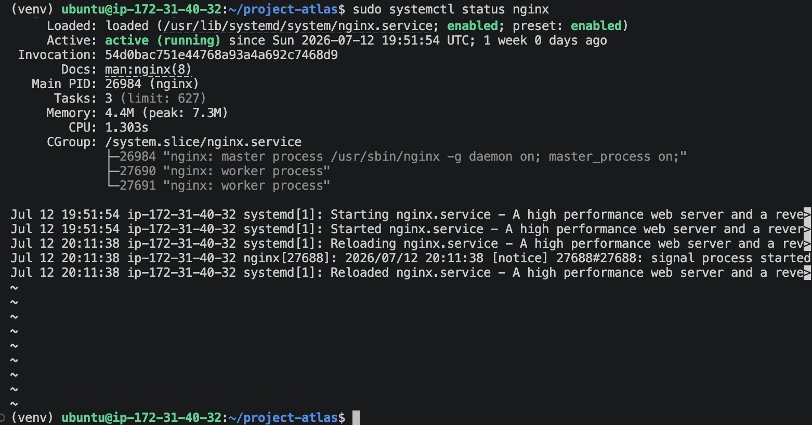
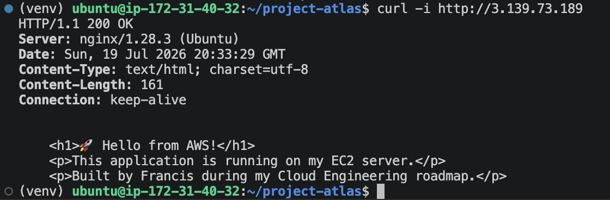
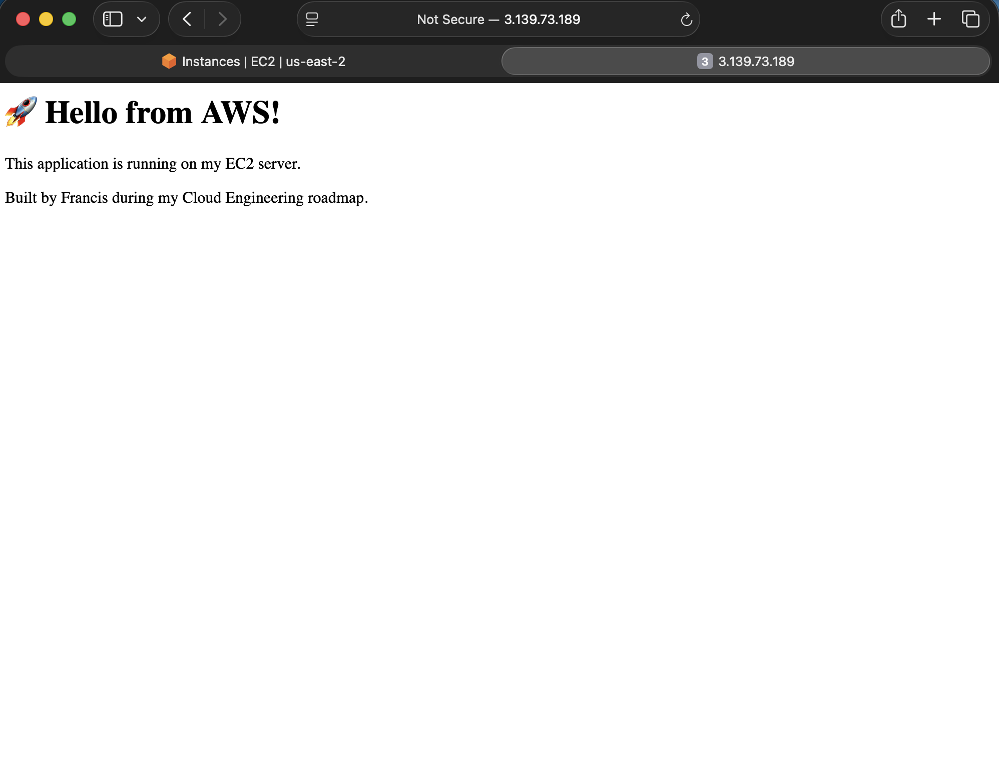

# Ticket #004 – Configure Nginx Reverse Proxy

## Overview

Configured Nginx as a reverse proxy in front of Gunicorn to handle incoming HTTP traffic. Validated that requests were correctly forwarded while improving scalability and production readiness.

## Objectives

- Install Nginx
- Configure reverse proxy
- Enable site configuration
- Verify external connectivity

## Technologies

- Nginx
- Gunicorn
- HTTP
- Linux

## Evidence

### Nginx Service Verification

Nginx was installed, enabled as a systemd service, and verified to be actively running on the EC2 instance.

---

### Reverse Proxy Validation

HTTP requests sent to the server on port 80 were successfully received by Nginx and forwarded to the Gunicorn application server listening on localhost:5000.

The response returned:

- HTTP/1.1 200 OK
- Server: nginx

This verified that Nginx was functioning as the public-facing reverse proxy while Gunicorn remained isolated from direct public access.

---

### Browser Validation

The application was successfully accessed through the EC2 instance's public IP address without exposing port 5000.

This confirms the complete request path:

Client Browser
→ Nginx (Port 80)
→ Gunicorn (Port 5000)
→ Flask Application

---

### Validation Result

The reverse proxy configuration successfully separated the web server from the application server.

Benefits of this architecture include:

- Public traffic terminates at Nginx
- Gunicorn remains accessible only through localhost
- Improved security through reduced attack surface
- Foundation for HTTPS, load balancing, and future scaling

This deployment mirrors a common production pattern used for Python web applications on Linux servers.
