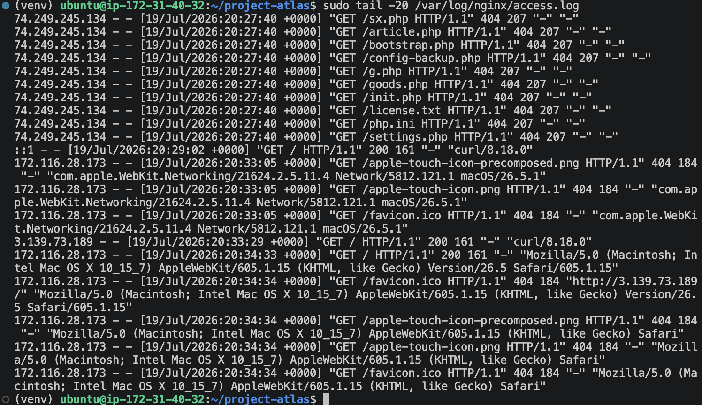
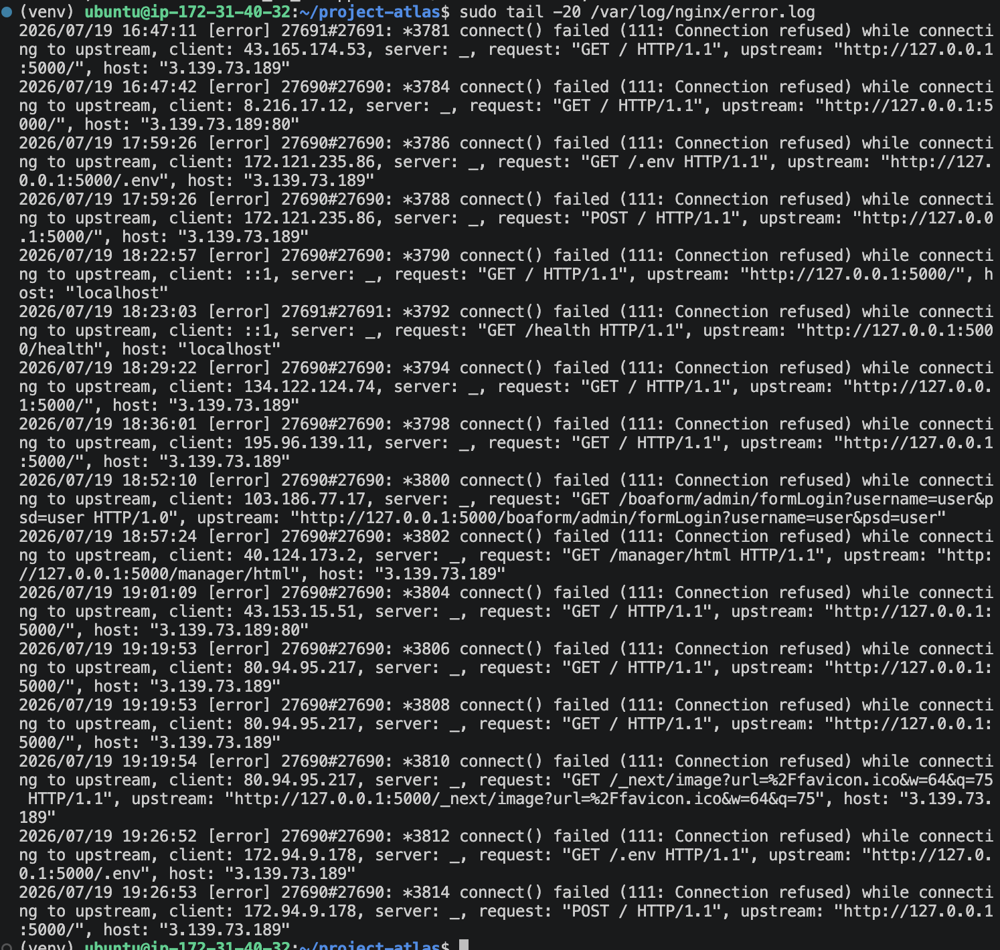

# Ticket #005 – Application Incident Investigation

## Overview

Performed a structured production-style investigation of an intermittent application outage using Linux service management and web server logs. Collected evidence before making changes and verified overall application health.

## Objectives

- Inspect Gunicorn service
- Review system logs
- Analyze Nginx access logs
- Review Nginx error logs
- Confirm application availability

## Technologies

- journalctl
- systemctl
- Nginx
- Linux

## Evidence

### Nginx Access Log Investigation

The Nginx access log was reviewed to verify incoming HTTP requests, requested routes, client activity, response status codes, and request timestamps.



The access log provided evidence that requests were reaching the reverse proxy and helped distinguish successful requests from application or upstream failures.

### Nginx Error Log Investigation

The Nginx error log was inspected to identify reverse-proxy and upstream communication failures.



The investigation demonstrated how a `502 Bad Gateway` can occur when Nginx remains available but cannot communicate with the Gunicorn backend.

### Incident Findings

The troubleshooting process identified the following conditions:

- Nginx was running and accepting requests.
- The Gunicorn backend was unavailable or unable to bind to its configured port.
- Nginx returned a `502 Bad Gateway` because no healthy upstream application server was available.
- Gunicorn logs revealed a port conflict involving `127.0.0.1:5000`.
- The conflicting process was removed and the Gunicorn systemd service was restored.

### Resolution Validation

After restoring Gunicorn, direct requests to port `5000` and proxied requests through Nginx returned successful HTTP responses.

### Operational Lesson

A `502 Bad Gateway` does not necessarily indicate that Nginx has failed. It often means the reverse proxy is functioning but cannot connect to its configured upstream service. Effective diagnosis requires checking each layer independently:

```text
Nginx service
    ↓
Nginx error log
    ↓
Gunicorn service
    ↓
Listening ports
    ↓
Application response

### Gunicorn Service Logs

Gunicorn's systemd journal was reviewed to identify repeated process failures and the `Address already in use` error affecting port `5000`.


## Outcome

Determined that the application and supporting infrastructure were operating normally. No service interruption or application failure was identified during the investigation.
