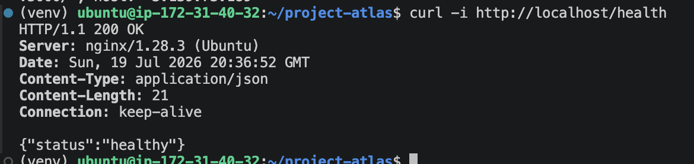

# Ticket #006 – Implement Application Health Check

## Overview

Implemented a production-style health check endpoint to verify application availability. Validated responses from both Gunicorn and Nginx while comparing infrastructure-specific HTTP headers and confirming requests through Nginx access logs.

## Objectives

- Create /health endpoint
- Validate JSON responses
- Compare Gunicorn and Nginx responses
- Verify access logging

## Technologies

- Flask
- Gunicorn
- Nginx
- curl
- HTTP

## Evidence

### Command-Line Health Validation

The `/health` endpoint was tested locally through Nginx using `curl`. The endpoint returned `HTTP/1.1 200 OK` with a JSON response indicating that the application was healthy.



Expected response:

```json
{"status":"healthy"}

## Outcome

Successfully implemented an application health endpoint and established a repeatable process for validating application availability across multiple infrastructure layers.
