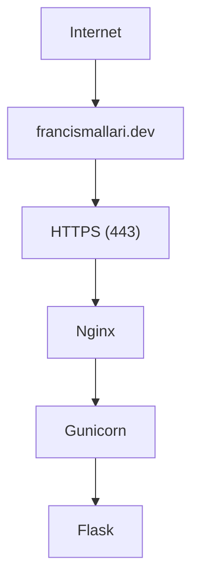
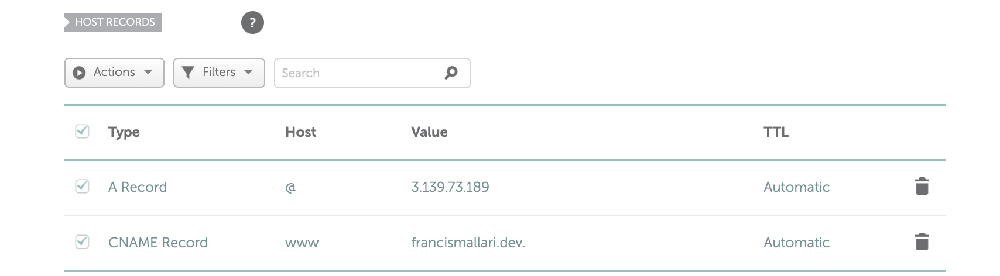
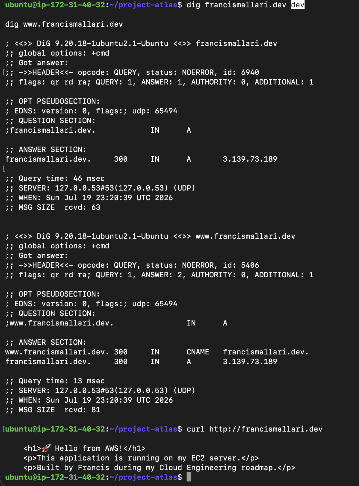
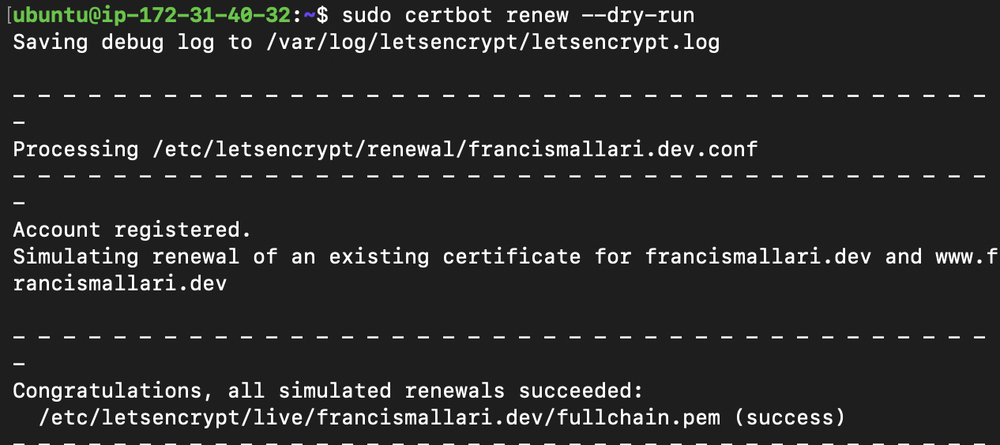
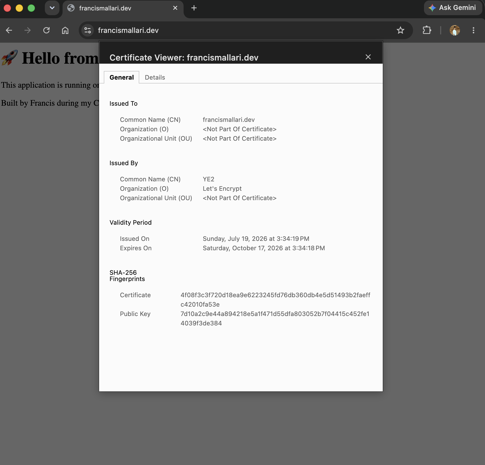
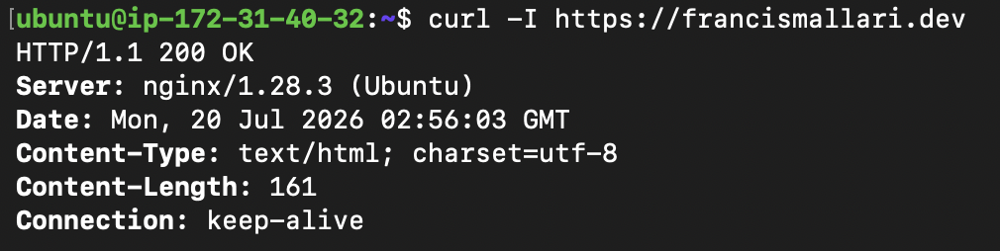
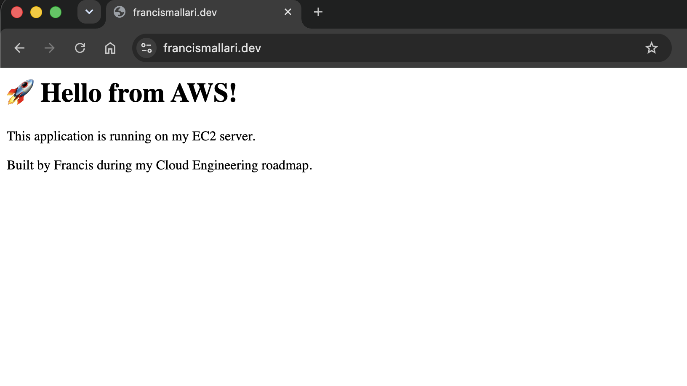

# Ticket #007 - Secure Application with HTTPS using Let's Encrypt

## Objective

Secure the production Flask application by configuring HTTPS using Let's Encrypt, Certbot, and Nginx. Ensure all traffic is encrypted and automatically redirected from HTTP to HTTPS.

---

## Live Application

- https://francismallari.dev
- https://www.francismallari.dev

---

## Technologies Used

- AWS EC2
- Ubuntu Linux
- Nginx
- Gunicorn
- Flask
- Certbot
- Let's Encrypt
- Namecheap DNS

---

## Architecture



---

## Implementation Steps

### 1. Configure DNS

Created the following DNS records:

- A Record
    - Host: @
    - Value: EC2 Public IP

- CNAME
    - Host: www
    - Value: francismallari.dev

---

### 2. Install Certbot

```bash
sudo apt update
sudo apt install certbot python3-certbot-nginx -y
```

---

### 3. Configure Nginx

Updated the Nginx server block:

```nginx
server_name francismallari.dev www.francismallari.dev;
```

---

### 4. Request TLS Certificate

```bash
sudo certbot --nginx \
  -d francismallari.dev \
  -d www.francismallari.dev
```

Certbot successfully:

- Requested certificate
- Validated domain ownership
- Installed the certificate
- Updated Nginx configuration
- Configured automatic renewal

---

### 5. Validate HTTPS

Verified:

- HTTPS loads successfully
- Browser trusts the certificate
- HTTP redirects to HTTPS
- Automatic renewal is configured

---

## Troubleshooting

### Issue

HTTPS requests timed out after the certificate was installed.

### Root Cause

AWS Security Group was missing an inbound rule for HTTPS (TCP 443).

### Resolution

Added an inbound rule:

- HTTPS
- TCP 443
- Source: 0.0.0.0/0

HTTPS immediately became accessible.

---

## Evidence

### DNS Records



---

### DNS Validation



---

### Certbot Installation



---

### Certificate Verification



---

### HTTPS Validation



---

### Browser Verification



---

## Lessons Learned

- DNS changes may require propagation time before browsers resolve the new records.
- HTTPS on AWS requires both a valid TLS certificate and an inbound Security Group rule for TCP port 443.
- Certbot can automatically update Nginx configuration and configure certificate renewal.
- Nginx terminates TLS and proxies requests to Gunicorn over the local interface, keeping the application server off the public network.
---

## Outcome

Successfully deployed a production-ready HTTPS-enabled Flask application using:

- AWS EC2
- Nginx
- Gunicorn
- Let's Encrypt
- Certbot

The application is securely accessible at:

https://francismallari.dev

and

https://www.francismallari.dev
