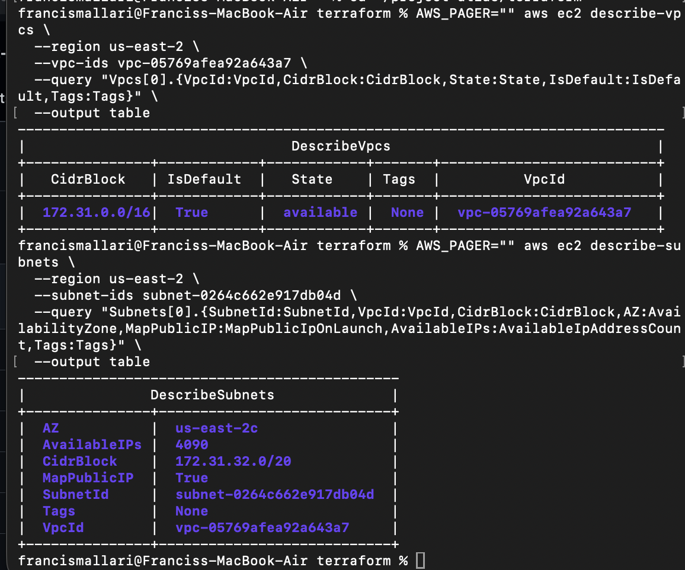
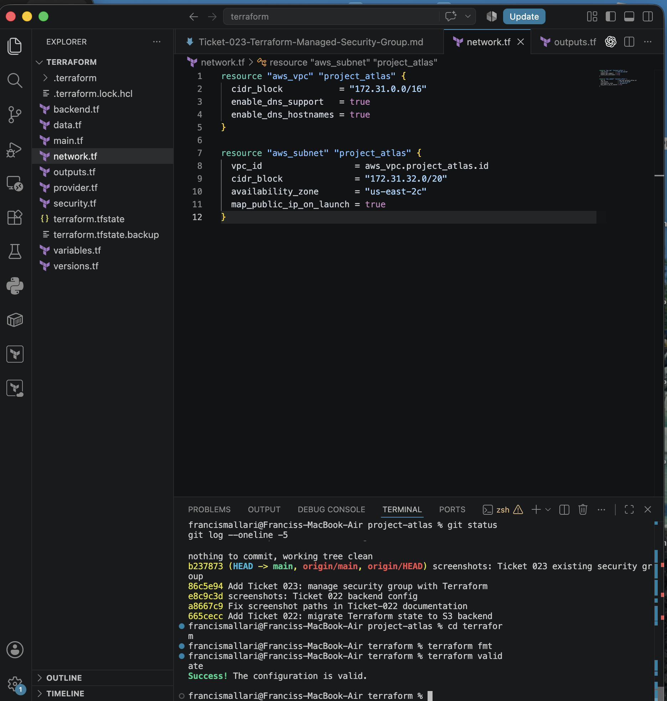
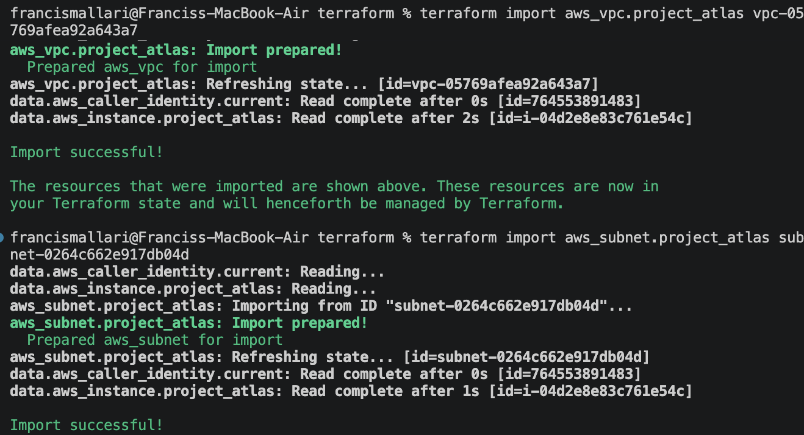
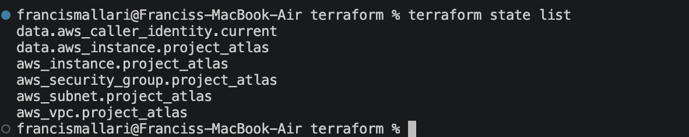

# Ticket 024 — Terraform-Managed VPC and Subnet

## Objective

Bring the existing Project Atlas VPC and subnet under Terraform management without recreating, replacing, or disrupting the live network.

This ticket continues the brownfield Infrastructure-as-Code workflow used throughout the Terraform phase of Project Atlas:

```text
Discover → Model → Import → Reconcile → Validate Zero-Change Plan
```

## Existing Network

The live AWS environment was inspected before any Terraform import or apply operation.

### VPC

| Attribute | Value |
| --- | --- |
| VPC ID | `vpc-05769afea92a643a7` |
| CIDR Block | `172.31.0.0/16` |
| Default VPC | `true` |
| State | `available` |

### Subnet

| Attribute | Value |
| --- | --- |
| Subnet ID | `subnet-0264c662e917db04d` |
| VPC ID | `vpc-05769afea92a643a7` |
| CIDR Block | `172.31.32.0/20` |
| Availability Zone | `us-east-2c` |
| Map Public IP on Launch | `true` |
| Available IP Addresses | `4090` |

## Architecture

```text
AWS Region: us-east-2
        |
        v
Default VPC
172.31.0.0/16
        |
        v
Subnet
172.31.32.0/20
us-east-2c
        |
        +-------------------+
        |                   |
        v                   v
Security Group          EC2 Instance
                         Project Atlas
```

## Implementation

### 1. Discover the Existing VPC

```bash
AWS_PAGER="" aws ec2 describe-vpcs \
  --region us-east-2 \
  --vpc-ids vpc-05769afea92a643a7 \
  --query "Vpcs[0].{VpcId:VpcId,CidrBlock:CidrBlock,State:State,IsDefault:IsDefault,Tags:Tags}" \
  --output table
```

The existing VPC was confirmed as the AWS default VPC in `us-east-2`.

### 2. Discover the Existing Subnet

```bash
AWS_PAGER="" aws ec2 describe-subnets \
  --region us-east-2 \
  --subnet-ids subnet-0264c662e917db04d \
  --query "Subnets[0].{SubnetId:SubnetId,VpcId:VpcId,CidrBlock:CidrBlock,AZ:AvailabilityZone,MapPublicIP:MapPublicIpOnLaunch,AvailableIPs:AvailableIpAddressCount,Tags:Tags}" \
  --output table
```

The subnet was confirmed to belong to the Project Atlas VPC and to automatically assign public IPv4 addresses at launch.

### 3. Define the Existing Network in Terraform

Created `terraform/network.tf`:

```hcl
resource "aws_vpc" "project_atlas" {
  cidr_block           = "172.31.0.0/16"
  enable_dns_support   = true
  enable_dns_hostnames = true
}

resource "aws_subnet" "project_atlas" {
  vpc_id                  = aws_vpc.project_atlas.id
  cidr_block              = "172.31.32.0/20"
  availability_zone       = "us-east-2c"
  map_public_ip_on_launch = true
}
```

The Terraform configuration was written to represent the existing AWS network before importing it into state.

### 4. Format and Validate

```bash
terraform fmt
terraform validate
```

Result:

```text
Success! The configuration is valid.
```

### 5. Import the Existing VPC

```bash
terraform import aws_vpc.project_atlas vpc-05769afea92a643a7
```

### 6. Import the Existing Subnet

```bash
terraform import aws_subnet.project_atlas subnet-0264c662e917db04d
```

### 7. Verify Terraform State

```bash
terraform state list
```

Terraform state now includes:

```text
data.aws_caller_identity.current
data.aws_instance.project_atlas
aws_instance.project_atlas
aws_security_group.project_atlas
aws_subnet.project_atlas
aws_vpc.project_atlas
```

This confirmed that the Project Atlas EC2 instance, security group, VPC, and subnet are all represented in Terraform state.

### 8. Validate the Post-Import Plan

```bash
terraform plan
```

Final result:

```text
No changes. Your infrastructure matches the configuration.
```

Terraform compared the live AWS networking resources against the HCL configuration and found no differences.

## Validation

Ticket 024 was successful when:

- The existing VPC was discovered before import
- The existing subnet was discovered before import
- The network configuration was represented in Terraform
- `terraform validate` completed successfully
- The VPC import completed successfully
- The subnet import completed successfully
- `terraform state list` contained both `aws_vpc.project_atlas` and `aws_subnet.project_atlas`
- The final `terraform plan` returned **No changes**
- No VPC or subnet replacement was proposed
- No production networking change was intentionally applied

## Evidence

1. 
2. 
3. 
4. 

## Key Takeaways

- Existing VPCs and subnets can be adopted into Terraform without being recreated.
- Network discovery should happen before import so Terraform can be modeled against reality.
- Terraform state can represent resources that were originally created manually.
- Importing a resource does not change the resource by itself.
- `terraform state list` verifies that resources are associated with Terraform state.
- `terraform plan` is the critical safety check after import.
- A zero-change plan confirms that Terraform configuration and live AWS infrastructure are aligned.
- Project Atlas currently runs inside the AWS default VPC rather than a custom application-specific VPC.

## Cloud/SRE Relevance

This ticket demonstrates a common cloud/platform engineering task: gradually converting existing networking infrastructure into Infrastructure as Code.

Skills demonstrated:

- AWS VPC discovery
- AWS subnet discovery
- CIDR and availability-zone inspection
- Terraform networking resources
- Terraform import
- Terraform state management
- Production-safe infrastructure adoption
- Drift validation

## Result

**Ticket 024 completed successfully.**

The existing Project Atlas VPC and subnet were imported into Terraform state and represented in HCL without recreating or modifying the live network.

The final Terraform plan returned:

```text
No changes. Your infrastructure matches the configuration.
```

Project Atlas now has its EC2 instance, security group, VPC, and subnet under Terraform management.

