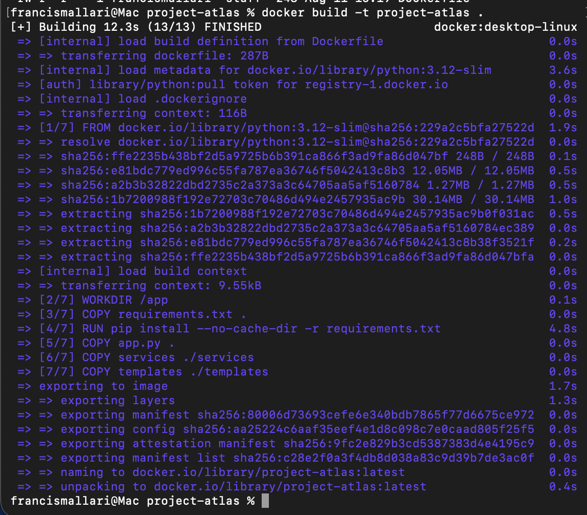
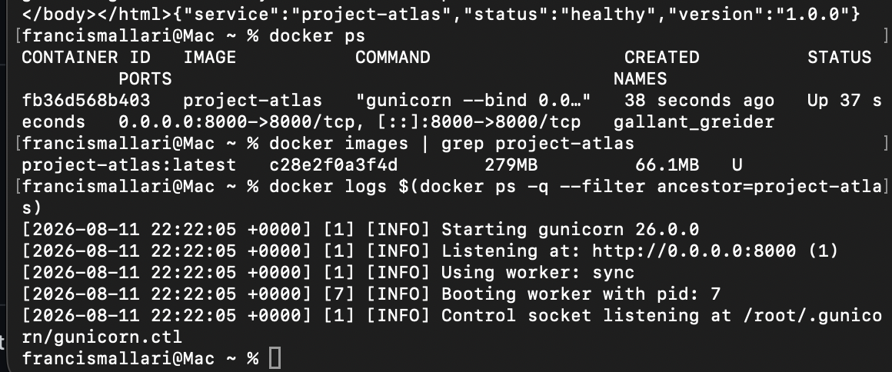
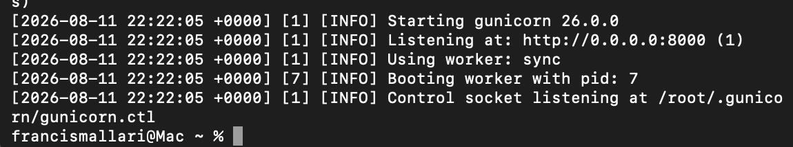

# Ticket 027 — Containerize Project Atlas with Docker

## Objective

Containerize the Project Atlas Flask application with Docker to create a portable and reproducible application runtime.

The goal was to package the application, Python dependencies, and Gunicorn runtime into a Docker image that can run consistently across environments.

---

## Architecture

```text
Docker Image
    |
    v
Docker Container
    |
    v
Gunicorn :8000
    |
    v
Flask Application
    |
    +-- /
    |
    +-- /health

````

## Implementation

Created a Dockerfile using a lightweight Python base image.

The container:

* Uses Python 3.12 slim
* Installs dependencies from requirements.txt
* Copies the Flask application into the image
* Runs the application with Gunicorn
* Exposes the application on port 8000

Image was built locally: 

```bash 
docker build -t project-atlas

The application was then started as a container: 

```bash 
docker run --rm -p 8000:8000 project-atlas

```

##Validation

Verified that the container was running:

```bash 
docker ps
````
Verified the Docker image: 

```bash
docker images | grep project-atlas
````
Tested application: 

```bash
curl http://localhost:8000/
````
Tested the health endpoint: 
```bash
curl http://localhost:8000/health

Returned: 

{
  "service": "project-atlas",
  "status": "healthy",
  "version": "1.0.0"
}
````
## Evidence

### Docker Image Build



### Container Runtime and Health Check



### Gunicorn Container Logs



## Key Takeaways 

* Containerized a Python/Flask application with Docker.
* Built a reproducible application runtime using a Dockerfile.
* Ran Gunicorn inside a Docker container.
* Published container port 8000 to the local host.
* Validated application and health endpoint connectivity.
* Used Docker runtime commands to inspect containers, images, and logs.
* Demonstrated a containerization workflow that can later support CI/CD and cloud deployment.

## Result

Project Atlas can now run as a portable Docker container rather than depending directly on the configuration of the host operating system.

This establishes the foundation for future container registry, automated build, CI/CD, and container deployment workflows.
