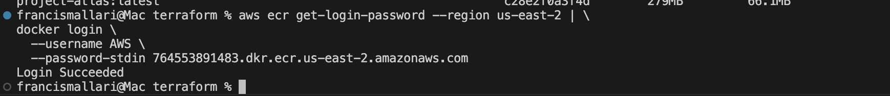
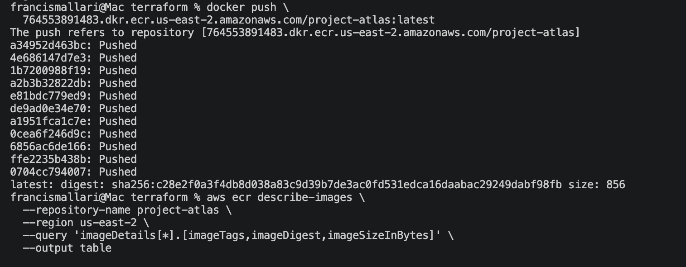
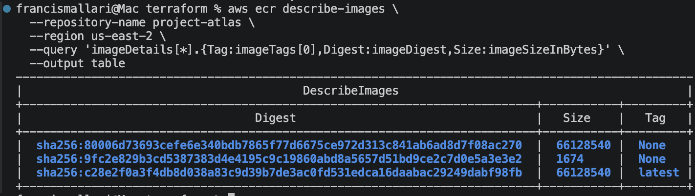

# Ticket 028 — Publish Project Atlas Container to Amazon ECR

## Objective

Provision an Amazon Elastic Container Registry (ECR) repository using Terraform and publish the containerized Project Atlas application to AWS.

This extends the Docker work completed in Ticket 027 by moving the application image from a local Docker environment into a cloud-hosted container registry that can support future automated deployment workflows.

---

## Architecture

```text
Project Atlas Source
        |
        v
Dockerfile
        |
        v
Docker Build
        |
        v
project-atlas:latest
        |
        v
Docker Tag
        |
        v
Amazon ECR
        |
        v
project-atlas:latest
```

The ECR repository itself is provisioned and managed through Terraform.

```text
Terraform
    |
    v
aws_ecr_repository
    |
    v
Amazon ECR
```

---

## Implementation

### Provision ECR with Terraform

Created an Amazon ECR repository for Project Atlas using Terraform.

```hcl
resource "aws_ecr_repository" "project_atlas" {
  name                 = "project-atlas"
  image_tag_mutability = "MUTABLE"

  image_scanning_configuration {
    scan_on_push = true
  }

  tags = {
    Name    = "project-atlas"
    Project = "ProjectAtlas"
  }
}
```

Added a Terraform output exposing the repository URL:

```hcl
output "project_atlas_ecr_repository_url" {
  description = "ECR repository URL for Project Atlas"
  value       = aws_ecr_repository.project_atlas.repository_url
}
```

Validated the Terraform configuration:

```bash
terraform fmt
terraform validate
terraform plan
```

Terraform proposed only the new ECR repository:

```text
Plan: 1 to add, 0 to change, 0 to destroy.
```

The repository was then provisioned:

```bash
terraform apply
```

Result:

```text
Apply complete! Resources: 1 added, 0 changed, 0 destroyed.
```

---

## ECR Verification

Verified the repository using the AWS CLI:

```bash
aws ecr describe-repositories \
  --repository-names project-atlas \
  --region us-east-2
```

The repository was created in the same AWS region as the Project Atlas infrastructure:

```text
us-east-2
```

Repository:

```text
project-atlas
```

---

## Docker Authentication

Authenticated the local Docker client with Amazon ECR:

```bash
aws ecr get-login-password --region us-east-2 | \
docker login \
  --username AWS \
  --password-stdin 764553891483.dkr.ecr.us-east-2.amazonaws.com
```

Authentication completed successfully:

```text
Login Succeeded
```

---

## Image Tagging

The Docker image created in Ticket 027 existed locally as:

```text
project-atlas:latest
```

Tagged the existing image with the Amazon ECR repository URI:

```bash
docker tag project-atlas:latest \
  764553891483.dkr.ecr.us-east-2.amazonaws.com/project-atlas:latest
```

Both tags referenced the same local Docker image, confirming that the image was retagged rather than rebuilt.

---

## Publish Image to Amazon ECR

Published the tagged image:

```bash
docker push \
  764553891483.dkr.ecr.us-east-2.amazonaws.com/project-atlas:latest
```

Docker successfully uploaded the container image layers and returned an image digest.

---

## Validation

Verified the published image directly through Amazon ECR:

```bash
aws ecr describe-images \
  --repository-name project-atlas \
  --region us-east-2 \
  --query 'imageDetails[*].{Tag:imageTags[0],Digest:imageDigest,Size:imageSizeInBytes}' \
  --output table
```

The repository contained:

```text
Tag: latest
Size: ~66.1 MB
Digest: sha256:c28e2f0a3f4d...
```

This confirmed that the Project Atlas container image was successfully stored in Amazon ECR.

---

## Evidence

### ECR Authentication



### Docker Image Push



### ECR Image Verification



---

## Key Takeaways

- Provisioned an Amazon ECR repository using Terraform.
- Extended Project Atlas infrastructure-as-code to include container registry infrastructure.
- Configured ECR image scanning on push.
- Authenticated Docker with a private AWS container registry.
- Tagged a locally built Docker image for an ECR repository.
- Published the Project Atlas container image to Amazon ECR.
- Verified the image tag, digest, and size using the AWS CLI.
- Connected Docker containerization with AWS infrastructure management.
- Established the artifact-storage layer required for future CI/CD and automated deployment workflows.

---

## Result

Project Atlas now has a cloud-hosted container artifact in Amazon ECR.

The application lifecycle has progressed from:

```text
Source Code
    ↓
Docker Build
    ↓
Local Container Image
```

to:

```text
Source Code
    ↓
Docker Build
    ↓
Container Image
    ↓
Amazon ECR
```

This establishes the foundation for future CI/CD automation where application changes can automatically build, test, publish, and eventually deploy new Project Atlas container images.
