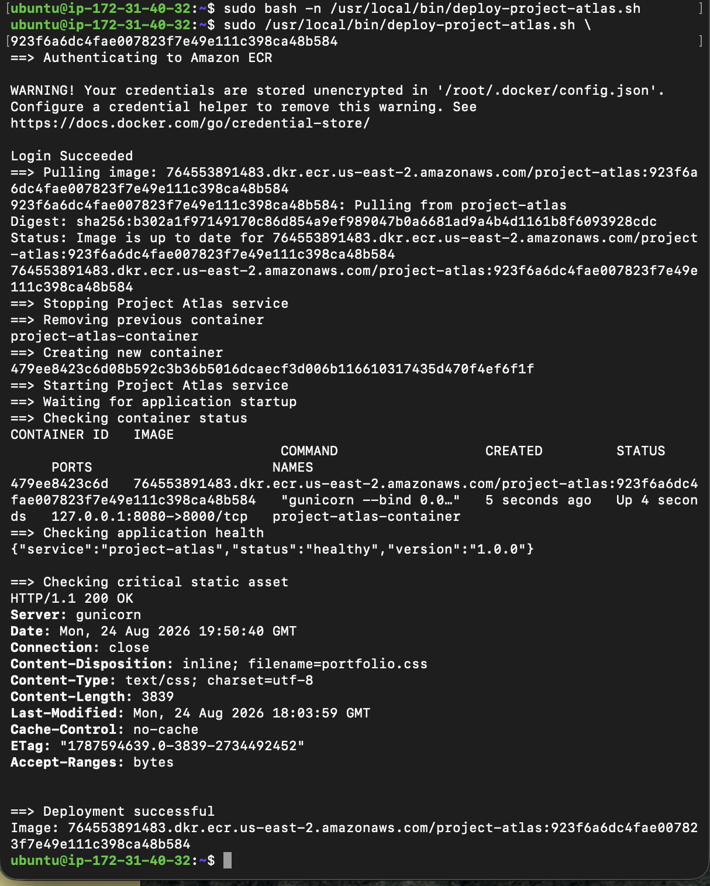
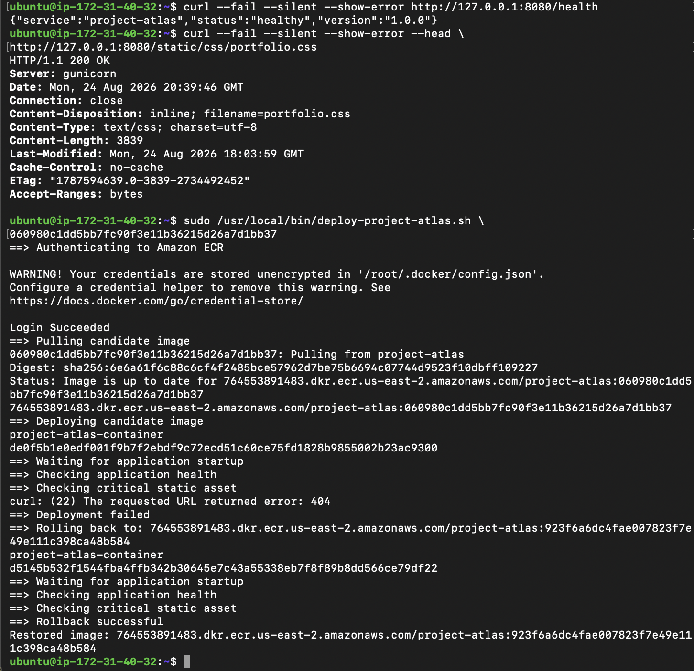
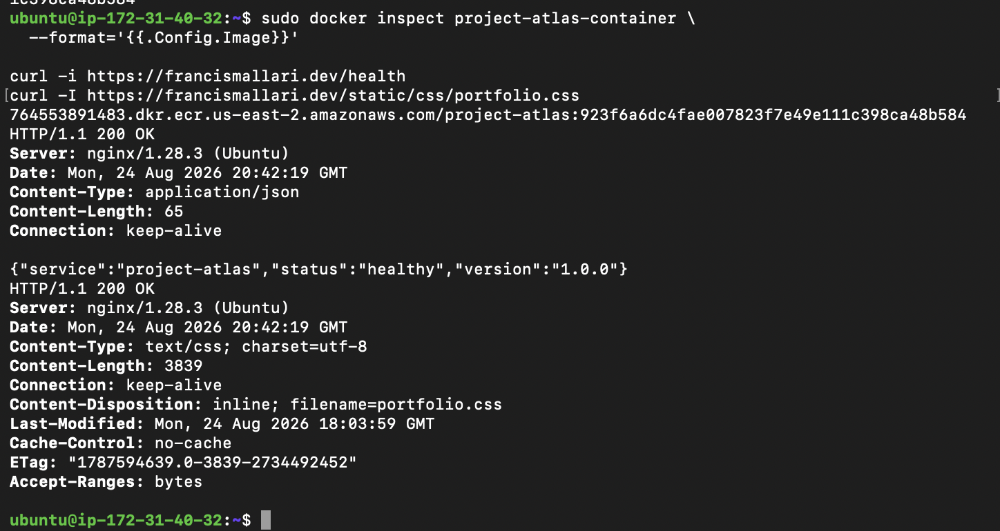

# Ticket 033 — Automated Deployment Validation and Rollback

## Objective

Improve the Project Atlas deployment process by adding automated post-deploymen$

The goal was to ensure that a newly deployed container is not considered succes$

---

## Architecture

Project Atlas currently uses:

- AWS EC2
- Amazon ECR
- Docker
- Gunicorn
- Nginx
- systemd
- HTTPS
- Bash deployment automation

Production traffic follows:

```text
Internet
   |
 HTTPS
   |
 Nginx
   |
127.0.0.1:8080
   |
Docker Container
   |
Gunicorn
   |
Flask / Project Atlas

```

Container images are stored in Amazon ECR and deployed to the EC2 instance.

##Problem

A successful container start does not necessarily mean a successful application deployment.

During earlier containerization work, an image could:

* start successfully,
* respond to the application health endpoint,
* but still be missing required static assets.

This created a situation where /health could report the application as healthy 

A safer deployment process needed to validate both application health and a critical frontend asset before declaring the deployment successful.

## Deployment Workflow

1. Determines the currently running container image.
2. Constructs the candidate ECR image reference.
3. Authenticates Docker to Amazon ECR.
4. Pulls the candidate image.
5. Stops the Project Atlas container service.
6. Removes the existing container.
7. Creates a container from the candidate image.
8. Starts the systemd-managed container.
9. Waits for application startup.
10. Validates /health.
11. Validates the critical portfolio.css static asset.
12. Declares the deployment successful only when validation passes.
13. Automatically rolls back to the previous image when validation fails.

-----

## Deployment Validation
   
Two checks are performed after deployment --

```bash
curl --fail --silent --show-error \

http://127.0.0.1:8080/health
```

Expected result:

```bash
{"service":"project-atlas","status":"healthy","version":"1.0.0"}
```

Critical static asset

```bash
curl --fail --silent --show-error --head \
http://127.0.0.1:8080/static/css/portfolio.css
```

A successful deployment requires the asset to return HTTP 200.

This additional validation protects against a deployment where the backend is technically running but the portfolio is incomplete or visually broken.

-----

## Failure test

To verify rollback behavior, an older ECR image was intentionally deployed:
```text
060980c1dd5bb7fc90f3e11b36215d26a7d1bb37
```
The candidate container started and passed the application health check.

However, validation of the critical static asset returned:

```text
curl: (22) The requested URL returned error: 404
```

The deployment script correctly identified the candidate release as unhealthy:
```text
==> Deployment failed
```

It then automatically initiated rollback to the previously running image:
```text
923f6a6dc4fae007823f7e49e111c398ca48b584
```

The rollback process recreated the Project Atlas container using the previous image and reran deployment validation.
   
Both checks succeeded.

The script reported:
```text
==> Rollback successful
```  

## Post-Rollback Validation
The running container image was verified with:
```bash
sudo docker inspect project-atlas-container \
  --format='{{.Config.Image}}'
```

The restored image was:
```text
923f6a6dc4fae007823f7e49e111c398ca48b584
```

Production health was then verified
```bash
curl -i https://francismallari.dev/health
```

Result:
```text
HTTP/1.1 200 OK
```

The critical stylesheet was also verified:
```bash
curl -I https://francismallari.dev/static/css/portfolio.css
```
   
Result:
```text
HTTP/1.1 200 OK
Content-Type: text/css; charset=utf-8
```  

---

## Issues Encountered

Several problems were discovered while building and testing the deployment automation.
   
Docker image reference formatting

An incorrectly placed shell continuation character caused Docker to receive a malformed image reference. 

This produced:

```text
invalid reference format
```
   
The deployment function was corrected so the complete image reference is passed cleanly to docker create. 

Shell command substitution

The command used to determine the currently running image initially contained malformed syntax.

It was corrected to:

```bash
CURRENT_IMAGE="$(docker inspect --format='{{.Config.Image}}' "$CONTAINER_NAME" 2>/dev/null || true)"
```
### Validation command formatting

Multiline curl commands initially caused the URL to be interpreted as a separate shell command.

This produced:
```text
curl: (2) no URL specified
```

The validation commands were simplified to prevent shell continuation errors.

### Rollback execution

The deployment path was adjusted so a failure while creating or starting the candidate container would also trigger rollback rather than allowing set -e to terminate the script before recovery logic could execute. 

---

## Key Learning

This ticket demonstrated an important reliability principle:

A running process is not necessarily a healthy service.

Checking only Docker or Gunicorn process state would not have detected the broken frontend. 

By validating both the application’s health endpoint and a production-critical static asset, the deployment process now tests whether Project Atlas is actually capable of serving the expected application. 

The rollback test also reinforced the value of retaining the previously deployed immutable image. Instead of attempting to repair a failed release in place, the deployment process can restore a known-good artifact. 

---

## Reliability Improvements

Ticket 033 introduced:

* Automated ECR image deployment
* Previous-image tracking
* Post-deployment health validation
* Critical asset validation
* Failed-release detection
* Automatic rollback
* Post-rollback validation
* Known-good image recovery

These controls reduce the risk of leaving Project Atlas in a degraded state after a deployment. 

---

## Evidence

Screenshots for this ticket document:

* Successful automated deployment
* Detection of a failed candidate release
* Automatic rollback to the previous ECR image
* Successful rollback validation
* Production health after recovery

---

## Skills Demonstrated

* Docker container lifecycle management
* Amazon ECR
* Bash scripting
* Linux system administration
* systemd service management
* Nginx
* HTTP health checks
* Deployment validation
* Failure detection
* Automated rollback
* Incident troubleshooting
* Production recovery
* SRE reliability principles

---

## Outcome

Project Atlas now has a deployment workflow capable of detecting a degraded container release and automatically restoring the previously running image. 

The final test intentionally deployed an image with a missing production asset, detected the failure through HTTP validation, restored the known-good ECR image, and returned the production application to a fully healthy state. 

### 1. Automated Deployment Success


### 2. Automatic Rollback Success


### 3. Post Rollback Production Validation



